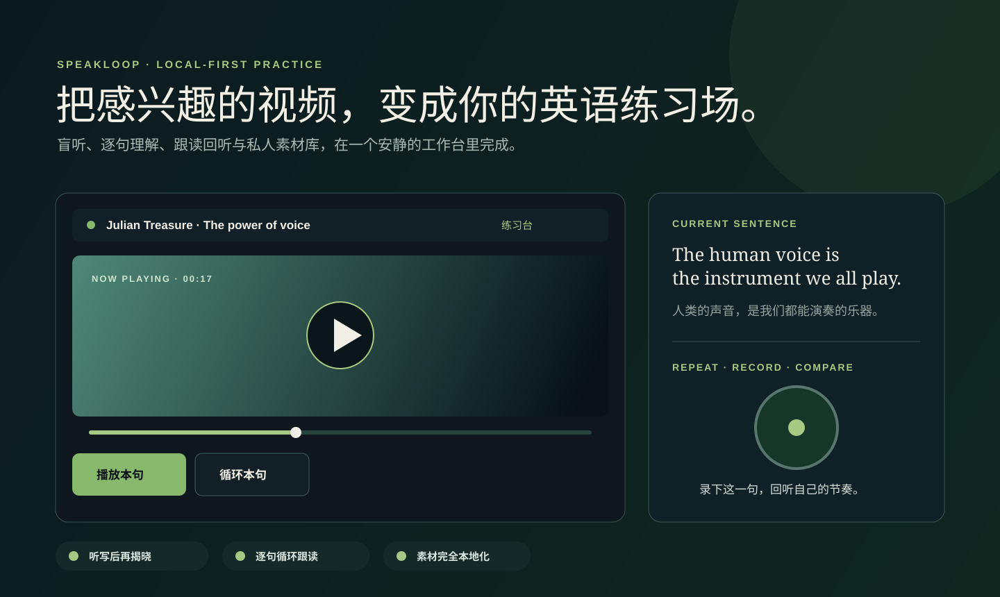
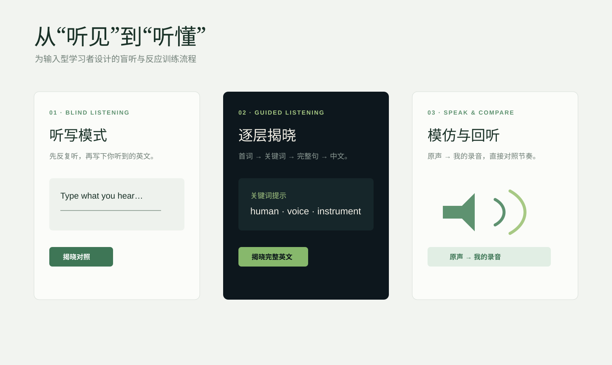
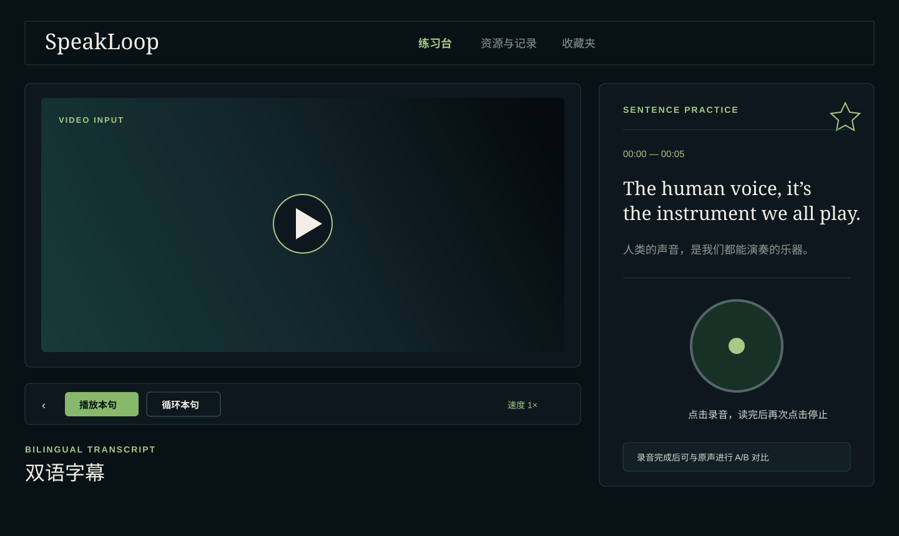
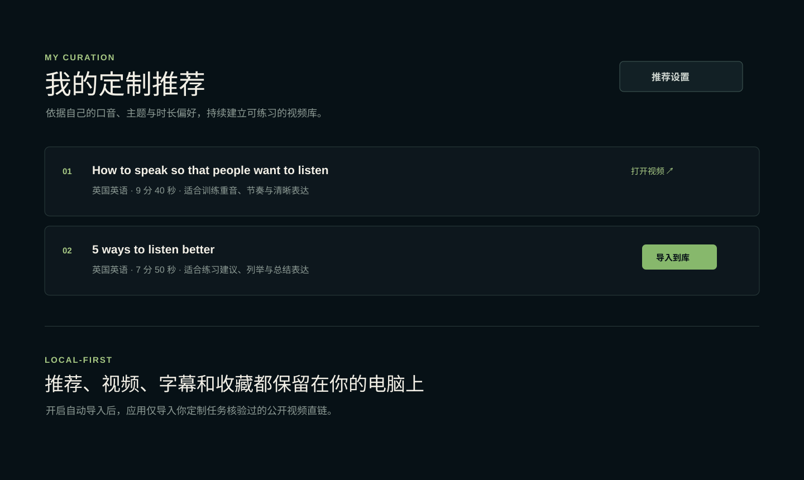

# SpeakLoop · Self-Directed Listening & Speaking Studio

[中文说明](README.zh-CN.md)

SpeakLoop is a local-first listening and speaking lab for Chinese learners of English. It turns videos you genuinely want to watch into a repeatable practice loop:

**blind listen → understand in context → shadow one sentence → compare your recording → save the useful sentence**.

It is designed for a familiar gap: many learners can answer listening-test questions, yet still miss natural speech in videos and struggle to react quickly in real conversations. SpeakLoop is not only about pronunciation; it is for building stronger listening comprehension, quicker response, and a more natural feel for spoken English.



## Why SpeakLoop

Traditional test practice often rewards finding an answer, not understanding a whole stream of speech. At the same time, content you care about is more motivating than fixed textbook material—but it is hard to pause, transcribe, revisit, and imitate efficiently.

| The difficulty | What SpeakLoop helps you do |
| --- | --- |
| You hear English but cannot segment it into meaning | Blind dictation and progressive reveal make you listen before reading. |
| You understand a listening question but lose natural conversation | Work with real sentences in complete context, at your own speed. |
| You know an expression but cannot produce it quickly | Shadow the original, loop the sentence, then compare your recording. |
| You cannot sustain fixed materials | Build a private library from videos you chose yourself. |

## A closer look

| Listen before you read | Practice one sentence | Keep a personal input library |
| --- | --- | --- |
| **Dictation** and progressive reveal keep the transcript hidden until you are ready. | Replay, loop, A–B clips and recording turn a line into a small, repeatable drill. | Import your own videos or build recommendations around your preferred accent, topic and duration. |
|  |  |  |

The overview above is the complete loop: import a video, listen with intent, reveal only the help you need, then repeat and compare your recording. Your library stays on your own computer.

## Features

- Import MP4, WebM, and MOV videos into a local library.
- Generate English subtitles with your own OpenAI or Zhipu AI key.
- Translate subtitles with OpenAI, Zhipu AI, or DeepSeek.
- Edit English or Chinese subtitles; changes save automatically with the video.
- Sentence replay, sentence loop, 2–8 second A–B loop, speed control, and seeking.
- Blind dictation with word comparison and progressive reveal.
- Local recording, replay, and original-audio → your-recording A/B comparison.
- Optional Azure Speech pronunciation assessment for word feedback, target accent, and available prosody feedback.
- Favourite useful sentences and jump back to their original video positions.
- Personal recommendations through a Codex scheduled task; optionally auto-import verified direct video links without triggering transcription or translation.

## Typical workflow

1. Choose a talk, interview, vlog, or documentary you actually care about.
2. Import it and generate an English transcript with OpenAI or Zhipu AI.
3. Listen first with sentence replay, dictation, or progressive reveal.
4. Translate only when Chinese support is useful.
5. Shadow the sentence, record yourself, and compare the original with your recording.
6. Favourite reusable sentences and revisit them from the collection page.

## Installation

SpeakLoop is packaged as a Windows desktop application. The installer bundles the local runtime and an LGPL-compatible FFmpeg build, so ordinary learners do not need Node.js or a separate FFmpeg installation.

The first public installer will be attached to this repository's **GitHub Releases** page. It is not published there yet, so do not download a similarly named installer from another source.

### Windows desktop app

After a release is published:

1. Download `SpeakLoop-Setup-<version>.exe` only from GitHub Releases.
2. Verify the published SHA-256 checksum and third-party notices.
3. Run the installer, select an installation folder, and keep **Create a desktop shortcut** enabled if you want one.
4. Launch SpeakLoop from the desktop or Start menu. Your library is stored separately in `%APPDATA%\SpeakLoop`, rather than in the installation directory.

### Run from source (developers)

For contributing or running an unreleased development copy, follow the [English installation guide](docs/INSTALLATION.md) or [中文安装说明](docs/INSTALLATION.zh-CN.md). The source workflow requires Windows, Node.js 18+, and FFmpeg/FFprobe at `tools/ffmpeg/bin/`:

```bash
npm start
```

and open <http://localhost:4173>. This developer workflow is not needed for the desktop installer.

### Configure AI services

Open **Settings → API 设置**.

| Service | Used for | Notes |
| --- | --- | --- |
| OpenAI | English transcription and Chinese translation | Your own API key. |
| Zhipu AI | English transcription and Chinese translation | Used for short audio chunks. |
| DeepSeek | Chinese translation only | Not used for video transcription. |
| Azure Speech | Optional pronunciation assessment | May incur Azure charges. |

Keys live only in the current browser session. Closing the page clears them.

## Personal recommendations

Go to **资源与记录 → 推荐设置**, choose your accent, topics, duration, and count, then copy the generated prompt into a Codex scheduled task for this project. The task updates `user-data/recommendations.json`.

When **自动导入已核验的直链视频** is enabled, the next visit to the resources page imports unprocessed verified MP4/WebM direct links into the local library. It does **not** automatically transcribe, translate, or use paid AI credits.

## Privacy & local data

SpeakLoop is a local Node.js application, not a GitHub Pages site.

- `video-library/` stores imported videos and subtitle records.
- `user-data/` stores favourites and personal recommendations.
- These folders are ignored by Git and should never be committed.
- API keys are stored in session storage only.
- Files and recordings are sent to an AI provider only after you explicitly trigger a relevant action.

## Important notes

- Import only videos you have the right to download, store, and practise with.
- Automatic import accepts public HTTPS direct video links only, with a 300 MB per-file limit.
- Running the `public/` folder alone cannot provide imports, storage, transcription, or recommendation APIs; run `npm start` instead.

## License

SpeakLoop is released under the [MIT License](LICENSE). See the [licensing note](docs/INSTALLATION.md#licensing-and-ffmpeg) before distributing a desktop installer, especially if it bundles FFmpeg.

## Security

Please read the [security policy](SECURITY.md) before reporting a vulnerability or publishing an instance with your own API keys.

## Contributing

Bug reports, feature discussions, documentation improvements, and focused pull requests are welcome. Read the [contributing guide](CONTRIBUTING.md) before participating.

